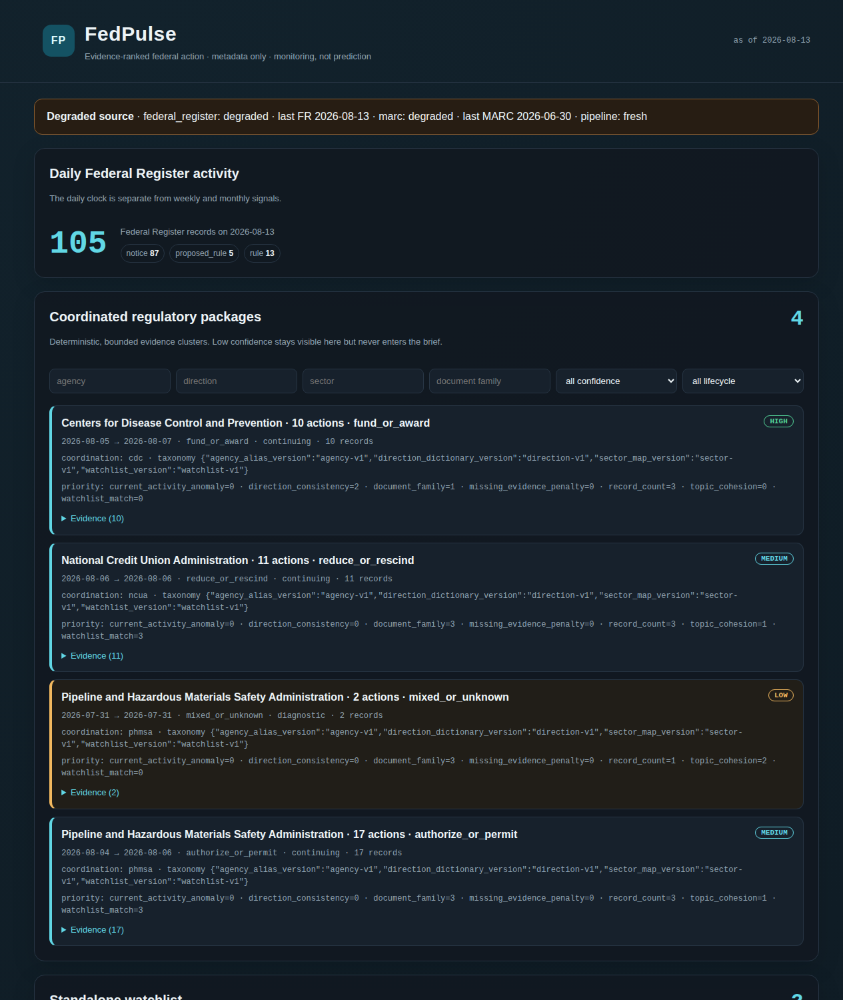
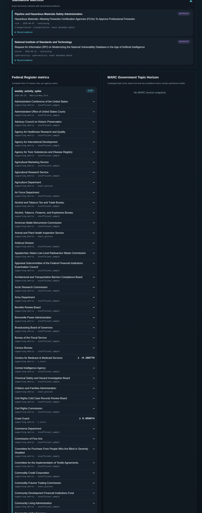
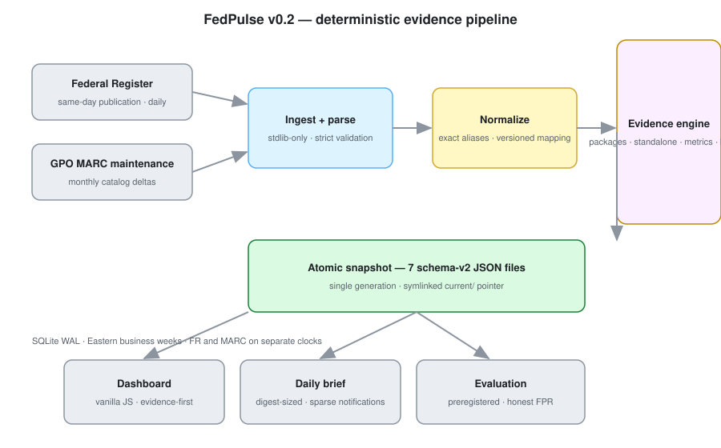
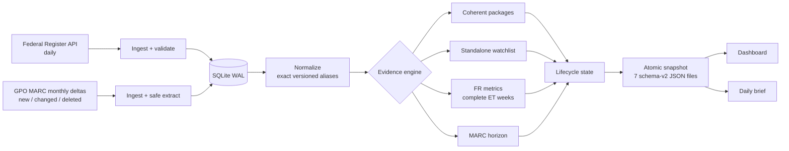
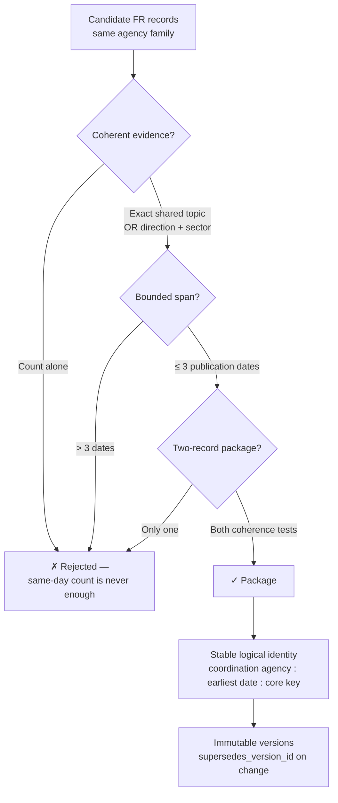
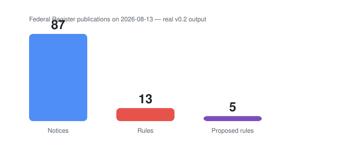
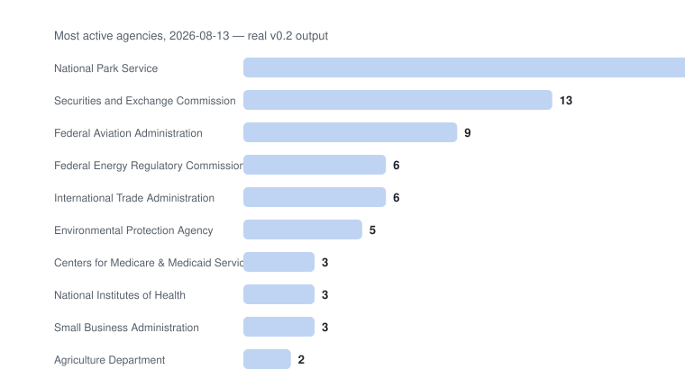
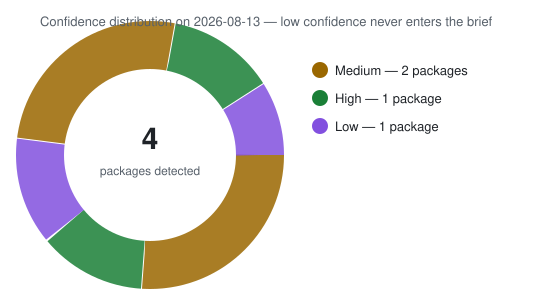
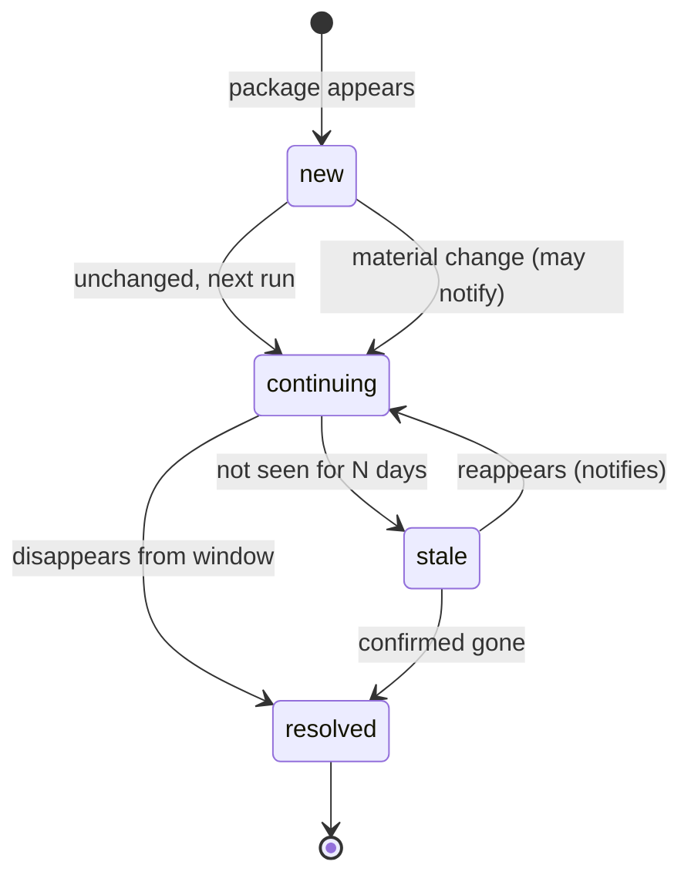

<div align="center">

# 🇺🇸 FedPulse

### The evidence-ranked federal regulatory watchlist

**What changed. Why it's noteworthy. Who's affected. Which official records prove it.**

[](https://www.python.org/)
[]()
[]()
[]()
[]()
[]()

**FedPulse turns 1.3 million public-domain government records into a ranked, auditable daily watchlist** — coherent regulatory packages, consequential standalone actions, and honest per-agency metrics — every conclusion backed by exact source records.

</div>

---

## 📖 Table of contents

- [Why FedPulse exists](#why-fedpulse-exists)
- [Live dashboard](#live-dashboard)
- [How it works](#how-it-works)
- [What you get: the evidence-first outputs](#what-you-get-the-evidence-first-outputs)
- [Real output, real data](#real-output-real-data)
- [Honest statistics by design](#honest-statistics-by-design)
- [Package lifecycle](#package-lifecycle)
- [Quick start](#quick-start)
- [Configuration](#configuration)
- [Operational behavior](#operational-behavior)
- [Development & testing](#development--testing)
- [Honest evaluation](#honest-evaluation)
- [Boundaries](#boundaries)
- [Data provenance](#data-provenance)

---

## Why FedPulse exists

Regulatory monitoring is drowning in noise. Every day the **Federal Register** publishes hundreds of documents, and the **GPO MARC catalog** quietly adds thousands of records. Compliance and government-affairs teams need to know:

> **What changed, why is it noteworthy, who may be affected, and which official records support that conclusion?**

FedPulse answers that question with **deterministic rules over structured metadata** — no generative NLP, no embeddings, no runtime LLMs, no analyst-in-the-loop. If the same data is fed in, the same answer comes out. Every conclusion ships with the exact record IDs, URLs, matched values, and taxonomy versions that produced it.

> [!IMPORTANT]
> FedPulse is a **monitoring and prioritization engine**, not a prediction engine. It finds and explains what is happening now — it does not claim to forecast markets or legal outcomes.

## Live dashboard

The dashboard is **dependency-free vanilla JavaScript** — no frameworks, no build step, no CDN.

<p align="center">
  
</p>

<p align="center">
  
</p>

The dashboard reads **one atomic generation** of seven schema-v2 JSON files through a symlinked `current/` pointer — readers can never observe a half-written day.

## How it works



### Two sources, two clocks

FedPulse deliberately keeps its two government feeds **statistically separate** — mixing them was a v0.1 design flaw:

| Source | Cadence | Clock field | Used for |
|---|---|---|---|
| **Federal Register API** | Daily | `publication_date` | Daily activity, packages, standalone actions, weekly metrics, pipeline ratios |
| **GPO MARC maintenance** | Monthly | `cataloged_date` | Government Topic Horizon (slower emergence signal) |

> [!NOTE]
> MARC is a **periodic cataloging feed, not a daily regulatory feed**. FedPulse never combines FR and MARC volume into one anomaly series.

### Pipeline



### Package detection — the hard part

Detecting a *coherent regulatory action* scattered across multiple Federal Register documents is the core of FedPulse:



## What you get: the evidence-first outputs

Every nightly run publishes **one atomic generation** of seven schema-v2 JSON files:

| File | Contents |
|---|---|
| `daily_activity.json` | Daily FR totals, document-type and per-agency counts |
| `packages.json` | Coherent regulatory packages with **evidence for every component record** |
| `standalone.json` | Consequential standalone actions with exact watchlist-match evidence |
| `fr_metrics.json` | Per-agency complete-week activity, sustained level shifts, pipeline ratios |
| `marc_horizon.json` | MARC-only topic emergence with cataloged-date evidence and batch-risk confidence |
| `health.json` | Source freshness contract: attempts, successes, last publication/catalog dates |
| `brief.json` | **Digest-sized** evidence-first brief; only high/medium-confidence, notifiable signals |

Each package evidence entry contains: `record_id`, `title`, `official_url`, `publication_date`, `doc_type`, matched phrases, coverage tags, and **taxonomy versions** — the full audit trail.

> [!TIP]
> Low-confidence packages are **dashboard-only**. They never enter the brief or a notification channel.

## Real output, real data

These charts are generated from a real v0.2 run against a **1.3-million-row semantic clone of the production database** (August 13, 2026 data). Not mock data.







That run detected coherent packages at CDC (fund/award actions), NCUA (credit-union rulemaking), and PHMSA (hazardous-materials authorizations) — each with 10–17 component records, stable package IDs, and exact official URLs per record.

## Honest statistics by design

The v0.1 product used the same z-score trick everywhere. v0.2 fixes that:

| Situation | v0.1 behavior | v0.2 behavior |
|---|---|---|
| Low-count baseline (mean < 5) | Ordinary z-score (wrong) | **Exact Poisson upper-tail** path |
| Zero-variance baseline | Manufactured alert | **No numeric z-score** — reports insufficient evidence |
| FR + MARC mixed | Combined into one series | **Never combined** — separate clocks |
| Week definition | Arbitrary windows | **Complete Monday–Friday Eastern weeks**, zero weeks included, partial current week excluded |
| Agency metrics | Global aggregate | **Per canonical agency** — one agency can't contaminate another's baseline |
| Rulemaking pipeline | Single opaque RCR churn | **`proposal_to_final_ratio`** (rulemaking pipeline) + **`activity_to_final_ratio`** (workload context), with 1.25× material-change gate and sample/percentile gates |
| MARC confidence | None | **High only with** ≥10 records, ≥3 cataloging dates, ≥3 agencies, no single date >50% |

## Package lifecycle



Notification semantics are **sparse and stateful**:

- Notify on: **new**, **materially changed/worsening**, **resolved**, **stale transition**
- **Never** notify solely because 48 hours elapsed with no change
- Direction changes bypass the cooldown
- Low-confidence packages never notify

## Quick start

```bash
# 1. Clone
git clone https://github.com/michaelcolenso/fedpulse.git && cd fedpulse

# 2. Install (uv required; runtime is stdlib-only)
uv sync

# 3. Run the offline test suite (temp DBs only, no network)
PYTHONPATH=src uv run python -m unittest discover -s tests -v

# 4. Generate v2 outputs from an existing database (offline)
PYTHONPATH=src uv run python -m fedpulse.pipeline_v2 \
  --db data/fedpulse.db --out data/outputs --skip-ingest --skip-marc

# 5. Full nightly run (network-dependent: FR + MARC ingestion)
PYTHONPATH=src uv run python -m fedpulse.pipeline_v2 --db data/fedpulse.db --out data/outputs

# 6. Serve the dashboard
uv run python -m http.server 8000 --directory .
# open http://localhost:8000/dashboard/
```

## Configuration

All taxonomy lives in `src/fedpulse/config/` as **versioned, exact, human-reviewable JSON**:

| File | Contents |
|---|---|
| `agency_aliases.json` | Exact versioned aliases → canonical IDs (CDC variants → `cdc`, etc.) |
| `direction_phrases.json` | Direction dictionary: word boundaries, Unicode normalization, 3-token negation window |
| `sector_map.json` | Sector taxonomy for direction+sector package evidence |
| `watchlists.json` | Exact watchlist rules: agencies, topics, doc types, phrases |
| `evaluation_events.json` | **Preregistered** historical events + negative controls |

Every output carries the exact taxonomy versions used, so any conclusion can be re-derived.

## Operational behavior

- **Loud failures** — malformed FR documents, partial ingestion, and corrupt markers fail the run; a failure snapshot is published so the dashboard never shows false freshness.
- **Atomic downloads** — ZIP and CSV downloads write to a temp file, fsync, then rename; failed downloads never corrupt a good file.
- **Safe extraction** — ZIP bombs, path traversal, and symlink members are rejected.
- **DB-scoped lock** — concurrent pipelines against the same database fail fast instead of corrupting state.
- **Idempotent migration** — v0.2 schema is additive; existing records are preserved, unchanged records are not rewritten nightly.

## Development & testing

- **Python 3.11+**, runtime **stdlib-only** (`sqlite3`, `zoneinfo`, `statistics`, `hashlib`, `json`, `fcntl`).
- All tests use **temporary SQLite databases** and golden fixtures — fully offline, fully deterministic.
- `tests/fixtures/v2_records.json` covers golden packages, unrelated same-day batches, transitive date spans, identity/supersession, negation, and low-confidence filtering.

```bash
PYTHONPATH=src uv run python -m unittest discover -s tests -v   # 78 tests
bash -n scripts/nightly.sh                                        # shell check
uv run python -m compileall -q src tests                          # compile check
```

## Honest evaluation

`src/fedpulse/config/evaluation_events.json` is the **preregistered ledger** — written before threshold tuning:

- Predictive events require the preregistered **minimum lead time** (≥ 30 days)
- Evidence appearing **after** an event is rejected
- **Negative controls** are separated by signal class: horizon controls never inflate the predictive false-positive rate
- Precision, recall, FPR, and median lead are reported for predictive signals; MARC horizon emergence is reported **separately** and is never counted as a predictive hit

> [!WARNING]
> The legacy v0.1 `4/9` backtest framing was misleading (event-date-only checks, post-event matches counted). FedPulse v0.2 replaces it with timing-correct, control-separated evaluation.

## Boundaries

FedPulse **does not**:

- Read or summarize full regulatory text
- Use generative NLP, embeddings, or runtime LLMs
- Provide legal conclusions or compliance guarantees
- Send messages to any external channel from this repository (Telegram delivery is a separate, operator-managed layer)

## Data provenance

- **Federal Register API** — https://www.federalregister.gov/developers
- **GPO MARC catalog** — public-domain catalog metadata from GPO's GitHub maintenance repositories:
  - https://github.com/usgpo/cataloging-records-all-cgp-utf8
  - https://github.com/usgpo/cataloging-records-CGP-maintenance-files

All input data is public-domain government metadata. The durable value is the cleaning, stable package identity, evidence packaging, freshness, and operational reliability on top of it.

---

<div align="center">

**FedPulse — deterministic regulatory signal, backed by official records.**

</div>
